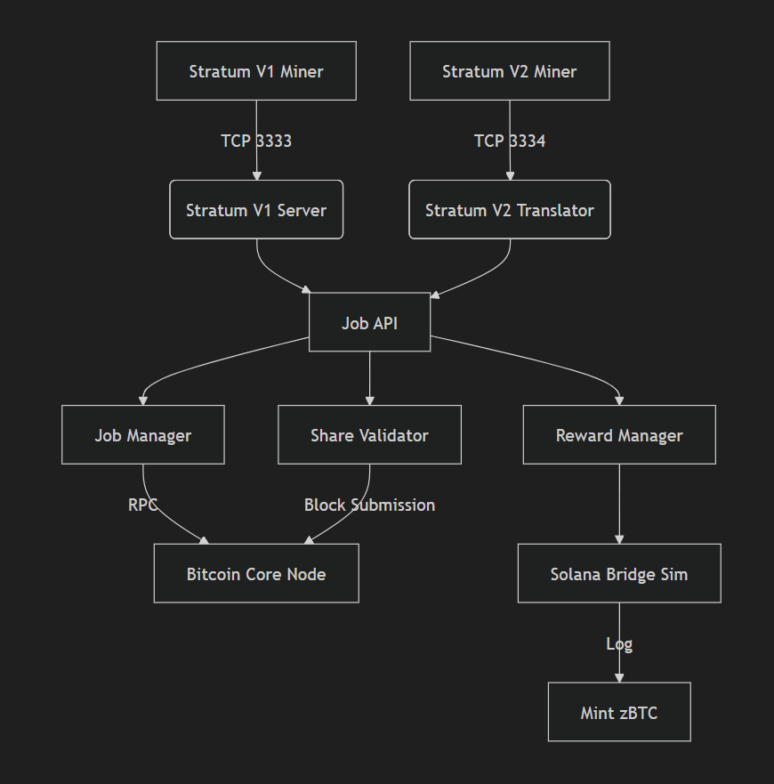
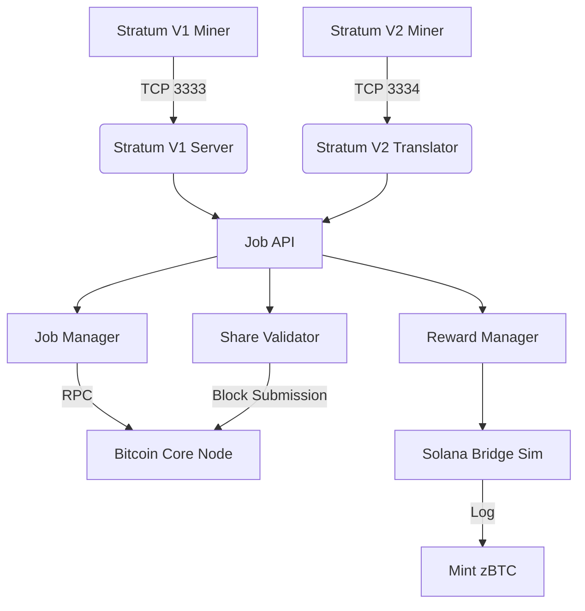

# Axon-like Mining Pool Walkthrough

## Overview
This project implements a custom Bitcoin Mining Pool from scratch (Node.js) that supports:
1.  **Stratum V1 Miners** (Legacy support).
2.  **Stratum V2 Miners** (Simulated Architecture).
3.  **Instant Solana Payouts** (Simulated "zBTC" Minting when a block is found).

The system runs on **Bitcoin Regtest** (Regression Test Network) for easy development and validation.

## Architecture





## Setup & Running

1.  **Start Bitcoin Core (Regtest)**:
    ```bash
    bitcoind -regtest -daemon
    ```

2.  **Start the Pool**:
    ```bash
    cd axon/pool
    npm start
    ```

3.  **Run Simulated Miners**:
    *   **V1 Miner**: `node test_miner.js`
    *   **V2 Miner**: `node test/sv2_test_client.js`

## Verification of Payouts

When the **V2 Miner** finds a "block" (forced via magic nonce `deadbeef` on regtest):

1.  The Pool validates the share in `shares.js`.
2.  It calls `rewards.js`.
3.  It fetches the miner's Solana Address (`SolanaMinerWallet123`).
4.  It calls `solana_bridge_sim.js`.
5.  You see this in the logs:

```text
[Solana Bridge] 🏛️  MINT INSTRUCTION INITIATED
[Solana Bridge] 📥  Recipient: SolanaMinerWallet123
[Solana Bridge] 💰  Amount:    5000000000 sats (50 zBTC)
[Solana Bridge] ✅  MINT SUCCESS: Signature ...
```

## Key Files
- `src/job_api.js`: The brain. Decouples protocol from logic.
- `src/stratum_v2_translator.js`: The bridge for V2 miners.
- `src/solana_bridge_sim.js`: The payout module.
