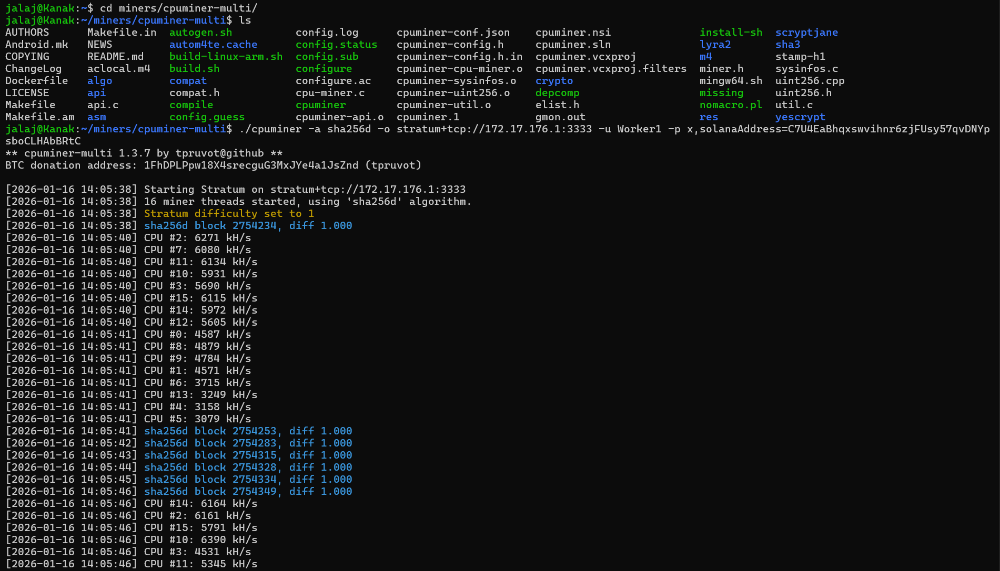

# Axon Pool Mining Guide

This guide covers everything you need to start mining on the **Axon Pool** (Bitcoin Testnet) and receiving **Solana (zBTC)** rewards.

> **💡 New to Mining?** [Read "Mining 101: Understanding the Concepts"](education/MINING_CONCEPTS.md) first!

## Prerequisites

1.  **A Computer**: Windows (WSL), Linux, or macOS.
2.  **Bitcoin Core**: For running a Testnet Node (optional, if you want to run the pool yourself).
3.  **CPU Miner**: Software to perform the hashing.
4.  **Solana Wallet**: To receive your zBTC rewards.

---

## 1. Setting Up Bitcoin Core (Testnet) (Optional) ( Only Required if you want to run the pool yourself)

If you are hosting the pool, you need a Bitcoin Core node.

1.  **Download & Install**: [https://bitcoin.org/en/download](https://bitcoin.org/en/download)
2.  **Configuration**: Create a file named `bitcoin.conf` in your Bitcoin data directory:
    *   **Windows**: `%APPDATA%\Bitcoin\bitcoin.conf`           By 'Windows + R'
    *   **Linux/WSL**: `~/.bitcoin/bitcoin.conf` 
    
    > **Command to open in WSL:**
    > ```bash
    > mkdir -p ~/.bitcoin && nano ~/.bitcoin/bitcoin.conf
    > ```

    **Add the following content:**
    ```ini
    # Network
    testnet=1
    server=1
    daemon=1
    
    # RPC Connection (Required for Pool)
    rpcuser=axonrpc
    rpcpassword=axonrpcpassword
    rpcport=18332
    rpcallowip=0.0.0.0/0
    
    # Mining
    prune=550                   # Minimum = ~550 MB for blocks → total ~2-4 GB
    dbcache=100                 # Optional: lower memory usage during sync (good for laptop)
    ```

3.  **Start the Node**:
    ```bash
    bitcoind -testnet
    ```
    *Wait for the node to sync (IBD). This can take a few hours/days depending on connection.*

---

## 2. Installing CPU Miner

We recommend using `cpuminer` (or a fork like `cpuminer-multi`) for CPU mining on Testnet.

### Linux / WSL (Ubuntu)
1.  **Install Dependencies**:
    ```bash
    sudo apt-get update
    sudo apt-get install build-essential libcurl4-openssl-dev automake pkg-config libjansson-dev
    ```
2.  **Clone & Build**:
    ```bash
    git clone https://github.com/pooler/cpuminer.git
    cd cpuminer
    ./autogen.sh
    ./configure CFLAGS="-O3"
    make
    ```
3.  **Verify**:
    ```bash
    ./minerd --help
    ```

### Windows
1.  Download a pre-compiled binary of **cpuminer-opt** or **cpuminer-multi** from GitHub releases.
2.  Extract the `.zip` file.
3.  Open PowerShell/CMD in that folder.

---

## 3. Connecting to Axon Pool

Once you have the miner installed, you can connect to the pool.

### Connection Details
*   **Protocol**: Stratum V1 (TCP)
*   **Algorithm**: SHA256d (Bitcoin)
*   **Port**: `3333`
*   **Username**: Your Mining ID (arbitrary)
*   **Password**: **CRITICAL** - This determines your Payout Address.

**Example Configuration:**
*   **URL**: `stratum+tcp://127.0.0.1:3333`
*   **User**: `Worker1`
*   **Password**: `x,solanaAddress=C7U4EaBhqxswvihnr6zjFUsy57qvDNYpsboCLHAbBRtC`

### The Password Format
To receive payouts on Solana, you must provide your **Solana Wallet Address** in the password field using a special tag.

**Format:** `x,solanaAddress=<YOUR_SOLANA_PUBKEY>`

*   `x`: Standard password placeholder (ignored).
*   `solanaAddress=...`: Your Devnet Wallet Address.

**Examples:**
1.  `x,solanaAddress=C7U4EaBhqxswvihnr6zjFUsy57qvDNYpsboCLHAbBRtC`
2.  `mySecretPass,solanaAddress=AwesomewalletAddressSoLana12345`

### Starting the Miner (Command)

**Replace `<POOL_IP>` with the IP address where `npm start` is running.**
*   If running locally: `localhost` or `127.0.0.1`
*   If running from WSL to Windows: Use your Windows IP (e.g., `172.x.x.x`).

```bash
./cpuminer -a sha256d -o stratum+tcp://<POOL_IP>:3333 -u Worker1 -p x,solanaAddress=C7U4EaBhqxswvihnr6zjFUsy57qvDNYpsboCLHAbBRtC
```

**Example Output:**
```text
[2026-01-16 10:00:00] 4 miner threads started, using 'sha256d' algorithm.
[2026-01-16 10:00:01] Stratum detected new block
[2026-01-16 10:00:02] Thread 1: hash: ... (accepted!)
```




---

## 4. Receiving Rewards

### How Payouts Work
1.  **Mining**: Your miner submits shares to the pool.
2.  **Block Found**: When the pool (or your miner) finds a valid Bitcoin Block (matches Network Difficulty).
3.  **Trigger**: The Pool Server detects the block and calculates rewards.
4.  **Payout**: The Pool automatically executes an on-chain **Solana Transaction**.

### Where do I get my Solana?
The pool sends **zBTC (Wrapped Bitcoin)** tokens directly to the Solana address you provided in the password.

*   **Network**: Solana Devnet
*   **Token Mint**: `F9GgGxst6S3yo5qWghCL27HnkxyBcp7UQq3rQygUWx7i` (zBTC)

### Checking Your Balance
You can view your transaction on the [Solana Explorer (Devnet)](https://explorer.solana.com/?cluster=devnet).
Paste your Wallet Address or the Transaction Signature provided in the Pool Dashboard.

---

## Troubleshooting

**Q: Miner asks for username/password, what do I put?**
A: Username can be anything (e.g., `miner1`). Password MUST contain `solanaAddress=YOURKEY` if you want payouts.

**Q: Connection Refused?**
A: Ensure the pool is running (`npm start`) and you are using the correct IP address. Firewall might be blocking port 3333.

**Q: "Low Difficulty Share"?**
A: This is normal on Testnet if the pool difficulty is set high. Keep mining!
